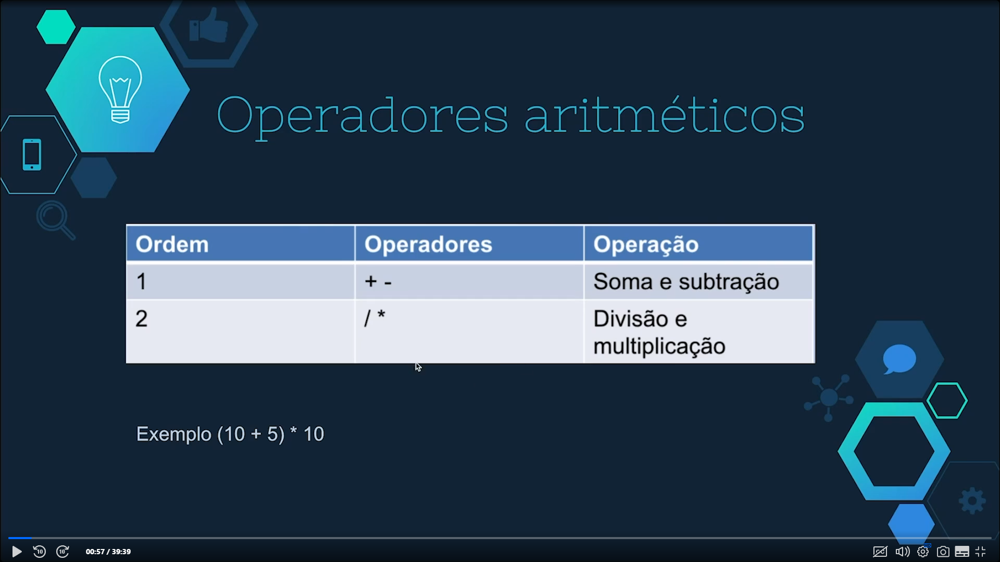

# Variáveis, tipos e operadores
## Tipos Primitivos

- int: números inteiros de 32 bits;
- float: números em notação de ponto flutuante;
- boolean: pode assumir dois valores, true e false;
- String: armazena caractere em notação de 16 bits, aceita dados alfannuméricos;
- byte: aloca número inteiro de 8 bits;
- short: armazena números inteiros de 16 bits;
- long: aloca números inteiros de 64 bits;
- double: números em notação de ponto flutuante.

## Váriaveis de classes e métodos/local

Uma variável de classe pode ser acessada escopo de classe e de método, e a variável local só pode ser acessada no esocpo de método.

## Operadores Aritméticos

São sinais que representam atribuições, cálculos e ordem dos dados. As operações seguem uma ordem de prioridades, ou seja, alguns cálculos são processados antes de outros.

## Operadores de atribuição

- =;
- +=;
- -=;
- *=;
- /=.

## Operadores de incremento e decremento
 São os operadores que nos permitem incrementar as variáveis em uma unidade. Podem ser usados diante ou atrás da variável.

 - ++ ou --;
 - int num1 = 10;
 - num1++: é igual á num1 + 1;
 - num2--; é igual á num2 - 1.

 ## Operadores relacionais 

 - <;
 - <=
 - >;
- >=;
- ==;
- !=. 

## Operadores lógicos

- &&(and);
- ||(or); 
- !(not).

